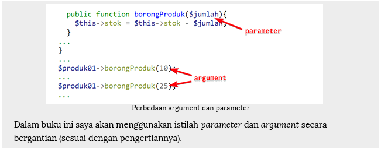

# Method
 di dalam sebuah class atau object tidak berbeda dengan function, oleh karena itu 
seluruh fitur-fitur function juga bisa kita terapkan. Salah satunya mengirim argument.

# Argument 
adalah sebutan untuk nilai input yang diberikan pada saat pemanggilan function. 
Sebagai contoh, PHP memiliki function bawaan sqrt() untuk mencari nilai akar kuadrat. 
Function sqrt() butuh 1 argumen berupa angka yang akan dicari nilai akar kuadratnya. Untuk 
mencari akar kuadrat dari 49, perintahnya adalah sqrt(49), angka 49 di sini merupakan 
sebuah argument. 

# Note
 Argument vs Parameter
 Istilah argument dan parameter juga serupa tapi tak sama. Keduanya sama-sama dipakai
 untuk menyebut nilai yang diinput ke dalam function atau method. Argument adalah 
sebutan untuk inputan pada saat pemanggilan method, sedangkan parameter adalah 
sebutan untuk inputan pada saat pendefinisian method. 
Dalam contoh di atas, variabel $jumlah adalah sebuah parameter, sedangkan angka 10 
dan 25 pada saat pemanggilan method adalah argument. Kedua istilah ini sering di 
pertukarkan, malah di dokumentasi resmi PHP (PHP Manual) istilah argument dipakai 
untuk menyebut keduanya

